# Backend JVM Senior Engineer (`agent-eng-backend-jvm`)

> **Pacote de Agente Especialista e Skills Multi-IA para Engenharia de Backend na JVM**  
> *Compatível nativamente com Google Antigravity, Anthropic Claude Code, OpenAI Codex e xAI Grok sob a
especificação [agentskills.io](https://agentskills.io).*

---

## 1. Visão Geral

O **`agent-eng-backend-jvm`** é um agente autônomo e assistente de engenharia de software de nível sênior, projetado
especificamente para projetar, desenvolver, auditar, otimizar e refatorar sistemas distribuídos, microsserviços de
missão crítica, BFFs (Server-Driven UI) e processamento assíncrono de alto rendimento na plataforma JVM.

### Stack Tecnológica & Baseline Oficial

- **Linguagens:** Java 25 LTS+ e Kotlin 2.4+ (estritamente focado no ecossistema de servidor JVM).
- **Frameworks Centrais:** Spring Boot 4.1.1+ (Spring Framework 7.0, Spring Security 7.1, Spring Data, Jackson 3),
  Quarkus e Jakarta EE.
- **Concorrência Moderna:** Project Loom (Virtual Threads), Concorrência Estruturada (`StructuredTaskScope`),
  `ScopedValue`, prevenção ativa de pinagem de threads (`synchronized` vs `ReentrantLock`), além de Coroutines Kotlin
  idiomáticas para WebFlux e Ktor.
- **Segurança Defensiva:** OWASP Top 10:2025, OWASP API Security Top 10:2023, OWASP ASVS 5.0, Defesa em Profundidade,
  autorização fail-closed (BOLA/BFLA), SSRF mitigation e Criptografia Pós-Quântica (FIPS 203/204/205 - ML-KEM / ML-DSA).
- **Arquitetura:** Microsserviços orientados a eventos (Kafka, RabbitMQ, SQS), arquiteturas limpas (Hexagonal / Clean
  Architecture), Server-Driven UI BFFs resilientes e APIs REST/GraphQL.

---

## 2. Arquitetura do Repositório

O repositório é organizado para permitir tanto a interoperabilidade universal quanto a carga nativa em cada assistente
de IA:

```text
pack-skill-agents/
├── plugin.json                              # Manifesto universal do agente (agentskills.io)
├── AGENTS.md                                # Persona canônica e diretrizes universais
├── CLAUDE.md                                # Instruções específicas para Claude Code
├── GEMINI.md                                # Instruções específicas para Google Antigravity
├── LICENSE                                  # Licença de uso
├── README.md                                # Documentação oficial e guia Multi-IA
│
├── .claude-plugin/
│   └── plugin.json                          # Manifesto de integração Anthropic Claude Code
├── .gemini-plugin/
│   └── plugin.json                          # Manifesto de integração Google Antigravity
├── .codex-plugin/
│   └── plugin.json                          # Manifesto de integração OpenAI Codex
├── .grok-plugin/
│   └── plugin.json                          # Manifesto de integração xAI Grok
│
├── scripts/
│   ├── validate-plugin.ps1                  # Validador automatizado (PowerShell / Windows)
│   └── validate-plugin.sh                   # Validador automatizado (Bash / Linux / macOS)
│
└── skills/
    ├── java-kotlin-security-audit/          # Skill de Auditoria de Segurança OWASP & PQC
    │   ├── SKILL.md                         # Contrato principal da skill
    │   ├── README.md                        # Documentação da skill
    │   ├── assets/
    │   │   └── audit-report-template.md     # Template oficial de relatório de vulnerabilidades
    │   ├── scripts/
    │   │   ├── quick_scan.ps1               # Scanner estático rápido (PowerShell)
    │   │   ├── quick_scan.sh                # Scanner estático rápido (Bash)
    │   │   ├── quick_scan.bat               # Scanner estático rápido (Batch)
    │   │   └── quick_scan_rules.txt         # Regras de varredura estática
    │   └── references/                      # Guias técnicos aprofundados (Spring, Injection, etc.)
    │
    ├── java-kotlin-concurrency/             # Skill de Concorrência e Paralelismo JVM (Java 25 & Kotlin 2.4)
    │   ├── SKILL.md                         # Contrato principal da skill
    │   ├── AGENTS.md                        # Persona e regras específicas de concorrência
    │   ├── scripts/
    │   │   ├── scan-concurrency.sh          # Scanner estático de concorrência (Bash)
    │   │   └── scan-concurrency.ps1         # Scanner estático de concorrência (PowerShell)
    │   └── references/                      # 9 guias temáticos aprofundados (VT, Coroutines, etc.)
    │
    ├── concurrency-java21-review/           # Skill de Concorrência Legada & Migração Java 21
    │   ├── SKILL.md                         # Contrato principal da skill
    │   ├── AGENTS.md                        # Regras e baseline da skill
    │   └── references/                      # Guias técnicos (Virtual Threads, Carrier Pinning, etc.)
    │
    ├── clean-code/                          # Boas práticas de legibilidade e manutenibilidade
    │   ├── SKILL.md
    │   └── README.md
    ├── design-patterns/                     # Padrões GoF e corporativos na JVM
    │   ├── SKILL.md
    │   └── README.md
    └── solid-principles/                    # Princípios SOLID aplicados à JVM moderna
        ├── SKILL.md
        └── README.md
```

### Diagrama de Relacionamentos do Pacote

```mermaid
graph TD
    subgraph Multi_AI_Entrypoints ["Manifestos e Entrypoints Multi-IA"]
        P_UNI["plugin.json (Universal)"]
        P_GEM[".gemini-plugin/plugin.json"]
        P_CLA[".claude-plugin/plugin.json"]
        P_COD[".codex-plugin/plugin.json"]
        P_GRO[".grok-plugin/plugin.json"]
    end

    subgraph Instructions ["Personas e Instruções Canônicas"]
        AGENTS["AGENTS.md (Regras Centrais & Persona)"]
        GEM["GEMINI.md"]
        CLA["CLAUDE.md"]
    end

    subgraph Core_Skills ["Habilidades Embutidas (Bundled Skills)"]
        SK_SEC["skills/java-kotlin-security-audit"]
        SK_CONC_NEW["java-kotlin-concurrency<br/>(Java 25 & Kotlin 2.4)"]
        SK_CONC["skills/concurrency-java21-review (Legado)"]
        SK_CLEAN["skills/clean-code"]
        SK_PAT["skills/design-patterns"]
        SK_SOL["skills/solid-principles"]
    end

    subgraph Validation ["Validação de Integridade"]
        VAL_PS1["scripts/validate-plugin.ps1"]
        VAL_SH["scripts/validate-plugin.sh"]
    end

    P_UNI --> AGENTS
    P_UNI --> SK_SEC
    P_UNI --> SK_CONC_NEW
    P_UNI --> SK_CONC
    P_UNI --> SK_CLEAN
    P_UNI --> SK_PAT
    P_UNI --> SK_SOL

    P_GEM --> GEM
    GEM --> AGENTS
    P_GEM --> SK_SEC
    P_GEM --> SK_CONC_NEW
    P_GEM --> SK_CONC
    P_GEM --> SK_CLEAN
    P_GEM --> SK_PAT
    P_GEM --> SK_SOL

    P_CLA --> CLA
    CLA --> AGENTS
    P_CLA --> SK_SEC
    P_CLA --> SK_CONC_NEW
    P_CLA --> SK_CONC
    P_CLA --> SK_CLEAN
    P_CLA --> SK_PAT
    P_CLA --> SK_SOL

    P_COD --> AGENTS
    P_COD --> SK_SEC
    P_COD --> SK_CONC_NEW
    P_COD --> SK_CONC
    P_COD --> SK_CLEAN
    P_COD --> SK_PAT
    P_COD --> SK_SOL

    P_GRO --> AGENTS
    P_GRO --> SK_SEC
    P_GRO --> SK_CONC_NEW
    P_GRO --> SK_CONC
    P_GRO --> SK_CLEAN
    P_GRO --> SK_PAT
    P_GRO --> SK_SOL

    VAL_PS1 -. Valida .-> P_UNI
    VAL_PS1 -. Valida .-> Core_Skills
    VAL_SH -. Valida .-> P_UNI
    VAL_SH -. Valida .-> Core_Skills
```



---

## 3. Matriz de Compatibilidade Multi-IA

O pacote implementa isolamento e manifestos dedicados para os principais assistentes de código com suporte a agentes de
software:

| Assistente / Plataforma             | Diretório / Manifesto                                        | Arquivo de Instruções                                   | Formato de Skills             | Status de Compatibilidade |
|:------------------------------------|:-------------------------------------------------------------|:--------------------------------------------------------|:------------------------------|:-------------------------:|
| **Google Antigravity / Gemini CLI** | [`.gemini-plugin/plugin.json`](./.gemini-plugin/plugin.json) | [`GEMINI.md`](./GEMINI.md) + [`AGENTS.md`](./AGENTS.md) | `SKILL.md` (YAML frontmatter) |      **100% Nativo**      |
| **Anthropic Claude Code**           | [`.claude-plugin/plugin.json`](./.claude-plugin/plugin.json) | [`CLAUDE.md`](./CLAUDE.md) + [`AGENTS.md`](./AGENTS.md) | `SKILL.md` (YAML frontmatter) |      **100% Nativo**      |
| **OpenAI Codex**                    | [`.codex-plugin/plugin.json`](./.codex-plugin/plugin.json)   | [`AGENTS.md`](./AGENTS.md)                              | `SKILL.md` (YAML frontmatter) |      **100% Nativo**      |
| **xAI Grok**                        | [`.grok-plugin/plugin.json`](./.grok-plugin/plugin.json)     | [`AGENTS.md`](./AGENTS.md)                              | `SKILL.md` (YAML frontmatter) |      **100% Nativo**      |
| **Universal / agentskills.io**      | [`plugin.json`](./plugin.json)                               | [`AGENTS.md`](./AGENTS.md)                              | `SKILL.md` (YAML frontmatter) |      **100% Nativo**      |

---

## 4. Guia de Instalação e Ativação por Plataforma

### 4.1. Google Antigravity / Gemini CLI

O Google Antigravity detecta o agente por meio do manifesto [`.gemini-plugin/plugin.json`](./.gemini-plugin/plugin.json)
e das regras declaradas em [`GEMINI.md`](./GEMINI.md).

#### Opção A: Como Plugin Global de Usuário

Instale o repositório no diretório de plugins do usuário:

```bash
# Clone ou crie link simbólico para a pasta de plugins do Antigravity
git clone https://github.com/wallanpsantos/pack-skill-agents.git "$HOME/.gemini/config/plugins/agent-eng-backend-jvm"
```

#### Opção B: Uso Direto no Workspace

Abra a raiz do projeto ou inclua este repositório como submódulo ou workspace vinculado. O Antigravity carrega
automaticamente as regras de [`GEMINI.md`](./GEMINI.md) e [`AGENTS.md`](./AGENTS.md).

---

### 4.2. Anthropic Claude Code

O Claude Code utiliza [`CLAUDE.md`](./CLAUDE.md) como ponto de entrada contextual e o manifesto [
`.claude-plugin/plugin.json`](./.claude-plugin/plugin.json).

#### Ativação

Basta iniciar a sessão do Claude Code na pasta do projeto ou adicionar o caminho aos plugins conhecidos:

```bash
cd pack-skill-agents
claude
```

O Claude Code absorverá as instruções de [`CLAUDE.md`](./CLAUDE.md) e carregará as definições de skills sob demanda
quando acionado.

---

### 4.3. OpenAI Codex

O OpenAI Codex consome o manifesto [`.codex-plugin/plugin.json`](./.codex-plugin/plugin.json) e adota as diretrizes
operacionais de [`AGENTS.md`](./AGENTS.md) como instruções de sistema (*system prompt*).

#### Ativação

Aponte o Codex Agent CLI ou ambiente Codex para a raiz do repositório:

```bash
codex --profile .codex-plugin/plugin.json
```

As habilidades `java-kotlin-security-audit`, `java-kotlin-concurrency`, `concurrency-java21-review`, `clean-code`, `design-patterns` e
`solid-principles` serão registradas no catálogo de ferramentas do Codex.

---

### 4.4. xAI Grok

O Grok utiliza o manifesto [`.grok-plugin/plugin.json`](./.grok-plugin/plugin.json) e integra o arquivo [
`AGENTS.md`](./AGENTS.md) como prompt de comportamento e governança técnica.

#### Ativação

Adicione as definições deste repositório ao seu workspace ou envie o contexto para o Grok CLI:

```bash
grok --system-prompt AGENTS.md --skills-dir skills/
```

---

## 5. Habilidades Embutidas (Bundled Skills)

O pacote fornece seis habilidades centrais de alta especialização técnica para engenharia de software na JVM:

### Matriz Geral de Habilidades

| Habilidade                         | Contrato Canônico                                                                   | Foco Principal                                                                                      | Gatilhos de Ativação                                                               | Baseline Tecnológico                       |
|:-----------------------------------|:------------------------------------------------------------------------------------|:----------------------------------------------------------------------------------------------------|:-----------------------------------------------------------------------------------|:-------------------------------------------|
| **Auditoria de Segurança**         | [`skills/java-kotlin-security-audit`](./skills/java-kotlin-security-audit/SKILL.md) | OWASP Top 10:2025, ASVS 5.0, BOLA/BFLA, SSRF, PQC (FIPS 203/204)                                    | Auditorias pré-produção, pentests, análise de injeção, conformidade OWASP          | Java 25 / Kotlin 2.4 / Spring Security 7.1 |
| **Concorrência e Paralelismo JVM** | [`skills/java-kotlin-concurrency`](./skills/java-kotlin-concurrency/SKILL.md)       | Virtual Threads (Java 25), Kotlin Coroutines 2.4, ScopedValue, carrier pinning, Mutex, Flow, integridade financeira | Revisão/implementação de concorrência, Loom, coroutines, thread safety, deadlocks | Java 25 LTS / Kotlin 2.4 / Spring Boot 4.1.1 |
| **Migração Concorrência Java 21**  | [`skills/concurrency-java21-review`](./skills/concurrency-java21-review/SKILL.md)   | Auditoria e migração de bases legadas Java 21 para Virtual Threads e análise retroativa             | Migração Loom de Java 21, auditoria retroativa, thread safety em bases legadas     | Java 21 LTS                                |
| **Clean Code**                     | [`skills/clean-code`](./skills/clean-code/SKILL.md)                                 | DRY, KISS, YAGNI, complexidade ciclomática, convenções de nomenclatura e code smells                | Limpeza e refatoração de código, simplificação de métodos, legibilidade            | Java 25 LTS / Kotlin 2.4+                  |
| **Padrões de Projeto**             | [`skills/design-patterns`](./skills/design-patterns/SKILL.md)                       | Padrões GoF (Criacionais, Estruturais, Comportamentais) e cálculo monetário seguro                  | Implementação de patterns, arquitetura de classes, precisão com `BigDecimal`       | Java 25 / Kotlin 2.4 / Spring Boot 4.1.1   |
| **Princípios SOLID**               | [`skills/solid-principles`](./skills/solid-principles/SKILL.md)                     | SRP, OCP, LSP, ISP, DIP com tipagem estática moderna (`sealed`, `record`)                           | Design e modularização de classes, desacoplamento, refatoração estrutural          | Java 25 / Kotlin 2.4 / Spring Boot 4.1.1   |

---

### 5.1. Auditoria de Segurança JVM (`skills/java-kotlin-security-audit`)

Documentação detalhada: [`skills/java-kotlin-security-audit/SKILL.md`](./skills/java-kotlin-security-audit/SKILL.md)

- **Escopo e Cobertura:**
    - **Normas:** OWASP Top 10:2025, OWASP API Security Top 10:2023 e OWASP ASVS 5.0.
    - **Vulnerabilidades Inspecionadas:** Injeção de SQL, NoSQL, SpEL, comandos de SO e XXE; vulnerabilidades de
      controle de acesso (BOLA/IDOR, BFLA, vazamentos de isolamento multi-tenant); Server-Side Request Forgery (SSRF);
      segurança criptográfica e vazamento de segredos/tokens; desserialização insegura com Jackson 3 e
      kotlinx.serialization; vulnerabilidades em supply chain (Maven, Gradle, GitHub Actions) e contêineres/Kubernetes.
    - **Criptografia Pós-Quântica (PQC):** Avaliação de risco quântico e prontidão para FIPS 203 (ML-KEM) e FIPS 204
      (ML-DSA) em sistemas regulados (bancos, meios de pagamento, seguradoras e saúde).
- **Scripts de Triagem Rápida (`quick_scan`):**
    - PowerShell (Windows): [
      `skills/java-kotlin-security-audit/scripts/quick_scan.ps1`](./skills/java-kotlin-security-audit/scripts/quick_scan.ps1)
    - Bash (Linux/macOS): [
      `skills/java-kotlin-security-audit/scripts/quick_scan.sh`](./skills/java-kotlin-security-audit/scripts/quick_scan.sh)
    - Batch (Legado CMD): [
      `skills/java-kotlin-security-audit/scripts/quick_scan.bat`](./skills/java-kotlin-security-audit/scripts/quick_scan.bat)
    - Regras: [
      `skills/java-kotlin-security-audit/scripts/quick_scan_rules.txt`](./skills/java-kotlin-security-audit/scripts/quick_scan_rules.txt)
- **Template de Relatório Canônico:**
    - [
      `skills/java-kotlin-security-audit/assets/audit-report-template.md`](./skills/java-kotlin-security-audit/assets/audit-report-template.md)

#### Como Executar a Triagem Rápida:

```powershell
# No PowerShell (Windows):
pwsh ./skills/java-kotlin-security-audit/scripts/quick_scan.ps1 -TargetDir "C:\caminho\do\meu-backend"
```

```bash
# No Bash (Linux/macOS/Git Bash):
bash ./skills/java-kotlin-security-audit/scripts/quick_scan.sh /caminho/do/meu-backend
```

---

### 5.2. Concorrência e Paralelismo JVM (`skills/java-kotlin-concurrency`)

Documentação detalhada: [`skills/java-kotlin-concurrency/SKILL.md`](./skills/java-kotlin-concurrency/SKILL.md)

- **Escopo e Cobertura:**
    - **Java 25 Virtual Threads & Project Loom:** Modelo unificado de concorrência para I/O-bound e CPU-bound workloads. Detecção e eliminação de carrier thread pinning (substituição de blocos `synchronized` em caminhos I/O bloqueantes por `ReentrantLock` com `try/finally`). Prevenção de thread exhaustion, dimensionamento ótimo de pools downstream (JDBC HikariCP, HTTP clients, message brokers) e eliminação da flag removida `jdk.tracePinnedThreads`.
    - **Scoped Values (`ScopedValue`):** Alternativa moderna, segura e imutável ao `ThreadLocal` para propagação de contexto em Virtual Threads, evitando vazamentos de memória e overhead de herança de thread context. Rejeição explícita de APIs preview (`StructuredTaskScope`, `--enable-preview`).
    - **Kotlin Coroutines 2.4+ (JVM de Servidor):** Concorrência estruturada no alvo JVM, despacho não-bloqueante (`Dispatchers.IO`, `Dispatchers.Default`), uso seguro de `Mutex` (nunca sob Virtual Threads com I/O bloqueante) e streams reativos assíncronos com `Flow`, `StateFlow` e `SharedFlow`. Banimento estrito de `GlobalScope`, `runBlocking` no hot-path de requisições e APIs experimentais sem justificativa formal.
    - **Consistência Financeira & Race Conditions:** Proteção rigorosa de mutações de saldo e estado financeiro concorrente. Uso mandatório de `BigDecimal` com escala e arredondamento explícitos (`RoundingMode.HALF_EVEN` / `HALF_UP`), banimento de `float`/`double`, proibição de operadores de divisão (`/`) em Kotlin sem `MathContext` explícito, e controle de concorrência com optimistic locking (`@Version`) e travas atômicas/pessimistas.
    - **Concorrência Assíncrona & Resiliência:** Auditoria de `CompletableFuture` (tratamento defensivo com `.exceptionally()` / `.handle()`, propagação de tracing e timeouts obrigatórios com `orTimeout()`), Spring `@Async` com executors dedicados e limites estritos, e backpressure com `Semaphore` e rate limiters.
- **Guias Técnicos Aprofundados (`references/`):**
    A skill disponibiliza 9 guias temáticos carregados sob demanda com prescrições normativas:
    1. [`references/virtual-threads.md`](./skills/java-kotlin-concurrency/references/virtual-threads.md): Virtual Threads no Java 25, eliminação de pinning, dimensionamento de pools e I/O não-bloqueante.
    2. [`references/virtual-threads-vs-completable-future.md`](./skills/java-kotlin-concurrency/references/virtual-threads-vs-completable-future.md): Comparativo arquitetural entre Virtual Threads, `CompletableFuture`, reativo (WebFlux) e ForkJoinPool.
    3. [`references/completable-future.md`](./skills/java-kotlin-concurrency/references/completable-future.md): Boas práticas com `CompletableFuture`, encadeamento assíncrono, timeouts e tratamento de falhas.
    4. [`references/spring-async.md`](./skills/java-kotlin-concurrency/references/spring-async.md): Spring `@Async`, propagação de `SecurityContext`, configuração de executors e integração com Virtual Threads.
    5. [`references/parallelism.md`](./skills/java-kotlin-concurrency/references/parallelism.md): Paralelismo CPU-bound, dimensionamento de `ForkJoinPool`, `parallelStream` consciente e isolamento de carga.
    6. [`references/kotlin-coroutines.md`](./skills/java-kotlin-concurrency/references/kotlin-coroutines.md): Kotlin 2.4 Coroutines na JVM, Structured Concurrency, `Dispatchers`, `Mutex`, `Flow` e interop com Java/VTs.
    7. [`references/financial-consistency.md`](./skills/java-kotlin-concurrency/references/financial-consistency.md): Integridade de saldo financeiro, `BigDecimal`, precisão monetária, locks atômicos e idempotência.
    8. [`references/classic-issues.md`](./skills/java-kotlin-concurrency/references/classic-issues.md): Diagnóstico e mitigação de race conditions, deadlocks, visibilidade de memória, `volatile` e `ConcurrentHashMap`.
    9. [`references/cloud-native-concurrency.md`](./skills/java-kotlin-concurrency/references/cloud-native-concurrency.md): Implantação cloud-native em Kubernetes, GraalVM native image, limites de CPU/cgroups, file descriptors e JFR profiling.
- **Scripts de Varredura de Concorrência (`scan-concurrency`):**
    Varredura estática profunda com detecção de APIs preview, thread pinning, locks sem try/finally, ScopedValue, CompletableFuture sem timeout, uso de GlobalScope/runBlocking em Kotlin e divisões de BigDecimal inseguras:
    - PowerShell (Windows / pwsh 7+): [`skills/java-kotlin-concurrency/scripts/scan-concurrency.ps1`](./skills/java-kotlin-concurrency/scripts/scan-concurrency.ps1)
    - Bash (Linux / macOS / Git Bash): [`skills/java-kotlin-concurrency/scripts/scan-concurrency.sh`](./skills/java-kotlin-concurrency/scripts/scan-concurrency.sh)

#### Como Executar a Varredura de Concorrência:

```powershell
# No PowerShell (Windows):
pwsh ./skills/java-kotlin-concurrency/scripts/scan-concurrency.ps1 -TargetDir "C:\caminho\do\meu-backend"
```

```bash
# No Bash (Linux/macOS/Git Bash):
bash ./skills/java-kotlin-concurrency/scripts/scan-concurrency.sh /caminho/do/meu-backend
```

---

### 5.3. Revisão de Concorrência Legada Java 21 (`skills/concurrency-java21-review`)

Documentação detalhada: [`skills/concurrency-java21-review/SKILL.md`](./skills/concurrency-java21-review/SKILL.md)

- **Escopo e Cobertura:**
    - **Project Loom & Virtual Threads:** Detecção de carrier thread pinning (uso de blocos `synchronized` ou chamadas
      JNI/nativas em caminhos I/O bloqueantes), saturação de scheduler pool, thread exhaustion e dimensionamento de
      pools HTTP/JDBC.
    - **Sincronização e Locks:** Substituição segura de `synchronized` por `ReentrantLock` com blocos `try/finally`
      estritos para evitar deadlocks e starvation.
    - **Concorrência Assíncrona & Reativa:** Auditoria de `CompletableFuture` (tratamento de erros com `exceptionally`/
      `handle`, propagação de contexto de segurança e tracing).
    - **Consistência Financeira e Transacional:** Prevenção de race conditions em mutações de saldo e estado monetário
      sob alta concorrência.
    - **Evitação de APIs Incubating/Preview:** Rejeição de APIs preview (`StructuredTaskScope` e `ScopedValue` fora do
      padrão estável da versão alvo), priorizando construções comprovadas para produção.

---

### 5.4. Clean Code & Manutenibilidade Idiomática (`skills/clean-code`)

Documentação detalhada: [`skills/clean-code/SKILL.md`](./skills/clean-code/SKILL.md)

- **Escopo e Cobertura:**
    - **Princípios Fundamentais:** Aplicação prática de DRY (*Don't Repeat Yourself*), KISS (*Keep It Simple, Stupid*) e
      YAGNI (*You Aren't Gonna Need It*).
    - **Nomenclatura Expressiva & Idiomática:** Regras para Java 25 e Kotlin 2.4 eliminando abreviações ambíguas,
      prefixos e sufixos desnecessários, com nomes reveladores de intenção.
    - **Design de Funções e Métodos:** Limites estritos de tamanho (< 20 linhas), responsabilidade única por método,
      número reduzido de parâmetros (máximo 3, uso de records/data classes para agrupamento contextual).
    - **Refatoração de Complexidade:** Redução de complexidade ciclomática e cognitiva através de guard clauses,
      eliminação de aninhamentos profundos e substituição de condicionais encadeadas.
    - **Eliminação de Code Smells:** Identificação e resolução de Feature Envy, Long Method, Large Class, Data Clumps e
      Primitive Obsession.

---

### 5.5. Padrões de Projeto & Arquiteturais na JVM (`skills/design-patterns`)

Documentação detalhada: [`skills/design-patterns/SKILL.md`](./skills/design-patterns/SKILL.md)

- **Escopo e Cobertura:**
    - **Padrões Criacionais Idiomáticos:** Builder seguro com records e classes imutáveis, Factory com pattern matching
      e interfaces seladas, e injeção de dependência por construtor no Spring Boot 4.1.1+.
    - **Padrões Estruturais Modernos:** Adapter, Decorator e Proxy idiomáticos, utilizando Class Delegation nativa em
      Kotlin (`by`) e interfaces estritas em Java 25.
    - **Padrões Comportamentais:** Strategy com funções de primeira classe / lambdas, Observer com publicadores de
      eventos assíncronos (`ApplicationEventPublisher`) e State com `sealed interface` / classes seladas.
    - **Cálculo Monetário Seguro:** Uso estrito de `BigDecimal` com `RoundingMode.HALF_EVEN` ou `HALF_UP`, prevenção
      total de representações em ponto flutuante (`float`/`double`) para valores monetários.

---

### 5.6. Princípios SOLID na JVM Moderna (`skills/solid-principles`)

Documentação detalhada: [`skills/solid-principles/SKILL.md`](./skills/solid-principles/SKILL.md)

- **Escopo e Cobertura:**
    - **SRP (Single Responsibility Principle):** Decomposição de classes com múltiplas razões de mudança em componentes
      coesos e especializados.
    - **OCP (Open/Closed Principle):** Extensibilidade sem modificação utilizando polimorfismo, `sealed interface` com
      pattern matching exaustivo e estratégias injetáveis.
    - **LSP (Liskov Substitution Principle):** Preservação de invariantes e contratos de subtipos sem lançar exceções
      inesperadas (`UnsupportedOperationException`) ou enfraquecer pré/pós-condições.
    - **ISP (Interface Segregation Principle):** Interfaces enxutas e focadas no cliente em vez de contratos
      sobrecarregados com métodos irrelevantes.
    - **DIP (Dependency Inversion Principle):** Dependência em abstrações e interfaces com isolamento de acoplamento a
      frameworks, garantindo testabilidade e portabilidade.

---

## 6. Scripts de Validação e Testes de Integridade

Para garantir que o pacote permaneça 100% íntegro em pipelines de Integração Contínua (CI/CD) ou durante desenvolvimento
local, foram disponibilizados validadores automatizados que verificam:

1. Sintaxe e validade de todos os manifestos JSON (`plugin.json` e submódulos `.claude-plugin`, `.gemini-plugin`,
   `.codex-plugin`, `.grok-plugin`).
2. Existência de todos os arquivos canônicos de regras e persona ([`AGENTS.md`](./AGENTS.md), [
   `CLAUDE.md`](./CLAUDE.md), [`GEMINI.md`](./GEMINI.md), [`README.md`](./README.md)).
3. Conformidade das skills com a especificação [agentskills.io](https://agentskills.io) (existência de `SKILL.md` com
   YAML frontmatter válido contendo `name:` e `description:`).

### Executando a Validação no PowerShell (Windows / pwsh 7+)

```powershell
powershell -NoProfile -ExecutionPolicy Bypass -File scripts\validate-plugin.ps1
```

*Saída esperada:*

```text
==> Validando plugin agent-eng-backend-jvm em: C:\Users\...\pack-skill-agents
  [PASS] JSON valido: plugin.json
  [PASS] JSON valido: .claude-plugin/plugin.json
  [PASS] JSON valido: .gemini-plugin/plugin.json
  [PASS] JSON valido: .codex-plugin/plugin.json
  [PASS] JSON valido: .grok-plugin/plugin.json
  [PASS] Documento presente: AGENTS.md
  [PASS] Documento presente: CLAUDE.md
  [PASS] Documento presente: GEMINI.md
  [PASS] Documento presente: README.md
  [PASS] Skill valida: java-kotlin-security-audit
  [PASS] Skill valida: java-kotlin-concurrency
  [PASS] Skill valida: concurrency-java21-review
  [PASS] Skill valida: clean-code
  [PASS] Skill valida: design-patterns
  [PASS] Skill valida: solid-principles
==> SUCESSO: Todos os componentes do agente foram validados!
```

### Executando a Validação no Bash (Linux / macOS / Git Bash)

```bash
bash scripts/validate-plugin.sh
```

*Saída esperada:*

```text
==> Validando plugin agent-eng-backend-jvm em: /caminho/pack-skill-agents
  [PASS] JSON valido: plugin.json
  [PASS] JSON valido: .claude-plugin/plugin.json
  [PASS] JSON valido: .gemini-plugin/plugin.json
  [PASS] JSON valido: .codex-plugin/plugin.json
  [PASS] JSON valido: .grok-plugin/plugin.json
  [PASS] Documento presente: AGENTS.md
  [PASS] Documento presente: CLAUDE.md
  [PASS] Documento presente: GEMINI.md
  [PASS] Documento presente: README.md
  [PASS] Skill valida: java-kotlin-security-audit
  [PASS] Skill valida: java-kotlin-concurrency
  [PASS] Skill valida: concurrency-java21-review
  [PASS] Skill valida: clean-code
  [PASS] Skill valida: design-patterns
  [PASS] Skill valida: solid-principles
==> SUCESSO: Todos os componentes do agente foram validados!
```

---

## 7. Regras de Comportamento e Governança Técnica

Ao operar com o `agent-eng-backend-jvm`, as seguintes diretrizes são inegociáveis:

1. **Evidência Antes de Afirmações:** Nenhum apontamento de vulnerabilidade ou bug de concorrência é emitido sem a
   indicação precisa do arquivo, linha, fluxo de chamada e demonstração técnica da falha.
2. **Código de Produção:** Qualquer código gerado deve ser completo, seguro por padrão (*deny-by-default*), aderente ao
   baseline Java 25 LTS / Kotlin 2.4 / Spring Boot 4.1.1+, compilável e pronto para esteiras de produção sem necessidade
   de adaptações triviais.
3. **Imutabilidade e Segurança Transacional:** Todo estado compartilhado deve ser protegido por travas explícitas
   (`ReentrantLock`) ou estruturas atômicas, evitando bloqueios desnecessários sobre Virtual Threads.

---

## 8. Licença

Este projeto é disponibilizado sob os termos da licença constante no arquivo [`LICENSE`](./LICENSE).